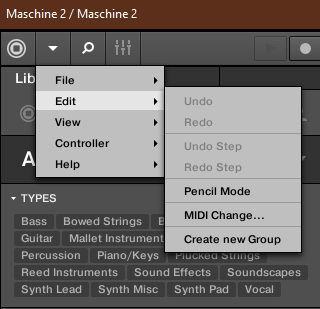

I recently bought a [Maschine Mikro][] - frankly they're priced so well, and bundle so much software, that they're pretty hard to refuse. I've been looking for ways to get close to the Ableton Live + Push workflow but fused with Bitwig, and I think this might be it (for me).

## Background

I want the UI & clean workflows of Bitwig, with some hands on, pressure sensative pads & simple step sequencer etc. that you get from a Live+Push set up. I have a launchpad mini, which is great for clip triggering but I find gets sufficiently complicated for anything else that it's not fun to use. I'd tried using a friends Push with the controller script for Bitwig, and although it was pretty darn cool it just wasn't as well integrated (unsuprisingly!), which made me feel like this wasn't going to solve the problem.

I stumbled upon the [Driven by Moss][] video, and the cut back interface of the Maschine Mikro looked appealing. One of the problems with the Push+Bitwig combo was that buttons didn't do what the labels said, so something more stripped back seemed less likely to fall into that trap.

As I thought about it more, though, this seemed like it would have the same issues as Push+Bitwig since it is a hack (for want of a better word)[^1]. Thinking more, it seemed like if I could control Maschine from bitwig (e.g. map clips to scenes in Maschine), then I'd be in the best of both worlds. Maschine can run as a standalone app & as a VST, so that seemed to make sense, and it looked like you could use either MIDI notes or Program Changes to change scene...

Anyway, one lunch time I found myself in playing with the micro. In about an hour I'd gotten a fairly decent understanding of how Maschine worked, and how the controller interacted with the software. I was pretty confident that if the clip to scene stuff would work out this would be a nice addition to the setup. So I bought the Mikro (see above re. price).

## Setting it up
So, there's a couple of things that tripped me up getting Maschine & Bitwig to play together, nothing terrible just a few things that are a bit more hidden away & require diving into the manual for. Hopefuly this'll help someone shortcut that in the future.

### Devices & chains
First of all you'll want to add a MIDI Program Change & a Maschine device to your track.

Put the Program Change up front, and put the Maschine in the Program Change devices chain. You can have the Maschine device follow the Program Change device, if you do that you need the Program CHange device to be unscoped.

Then click on the Maschine to see the outputs for the VST, this'll wanr you the plugin has multiple outputs.

You want to click Add Missing Chains to add everything.

### Welcome to the Maschine
Now lets look at Maschine. We want to do two things here:

1. Tell it to receive Program Change Events
2. Route different groups to different outputs

#### Program Change Events

How Maschine recieves a Program Change is configured under the Edit menu (obviously...):

That'll open a simple dialog, you want to set it up something like this (assuming you didn't change midi channel etc. on the Program Change device):

[Simples](midi_change.png)

#### Audio routing
For these screen grabs I made a simple 3 scene, 3 group track in Maschine. The first scene is "silence". You want this, or something like it, so you can tell Maschine to stop playing from Bitwig. The other two are an intro with one group playing, and a main riff bit with all three groups playing.

[Three Scenes, including the silence](maschenes.png)

For each group I configured the audio output to be a separate channel:

[Group A1](group_a1.png)

[Group B1](group_b1.png)

[Group C1](group_c1.png)

### Bitwig clips to Maschine Scenes
Now you need to set up corresponding clips in Bitwig, then tell them to fire the appropriate Program Change event to Maschine. Make three clips (one for each scene). You probaly want the clip length & launch q to match the length of the pattern in Maschine, but that's not required, and can mean you can chop & change faster from Bitwig, which can be interesting.

Open up the automation editor for your first clip, and pick out the Program setting for the MIDI Program CHange device:

[Clicking through this for each clip is mildly annoying...](setu_prog_change.png)

You want to set the Program value to the scene number you want to trigger so Bitwig clip 1 needs to fire program 1 to trigger Maschine scene 1 etc.

[Configure the silence](silence_clip.png)

You should now be able to jump through tempo & Q synced clips/scenes in bitwig (using for e.g. a launchpad to trigger clips) that play in Mashine, and whats more route the audio of those scenes independently. For example; here's silence doing it's thing:

[Enjoy the silence](silence_mixer.png)

Here's the intro (one group) clip:

[Introducing...](intro_mixer.png)

Finally, here's the riff (three groups playing):

[Groups on](riff_mixer.png)

## Fin

So far I'm really happy with this setup. It feels like I get the best of both worlds, I can have clips, sample, external hardware etc. all running out of Bitwig, and use Maschine & the Mikro to get hands on with drum parts, chords etc. Coupling that with the launchpad I feel like I've got a really tight setup.

Setting up the above each time is a bit of a faff, so I've bundled it up as a [preset][] - hopefully it works for you :)

[Maschine Mikro]: https://www.native-instruments.com/en/products/maschine/production-systems/maschine-mikro/
[Driven by Moss]: https://www.youtube.com/watch?v=KBIkoGOPBzM
[BopDJ]: https://www.bopdj.com/
[preset]: Maschine.bwpreset

[^1]: I mean, it is a hack, but it's a clever one that someone has spent a lot of time and effort making really good, and I might look at using the Maschine via the controller script in the not too distant future, as well as how I outline above.
