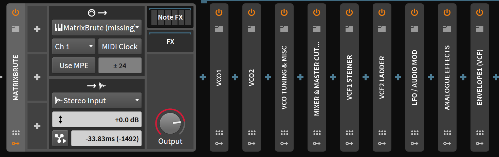

I'm a proud & very lucky owner of a Marixbrute. It's a cracking synth & I won't have a bad word said against it. 

I use [Bitwig][] as my DAW - it's a great combination of "traditional" and "clips", & I find I think about in a way similar to my modular (or Buzz Tracker... ah, those were the days....), as opposed to Logic which was more like a very clever tape machine. I've been trying to use outboard stuff from bitwig as much as possible - as good as VST's are, there's something more expressive or more unique from an actual instrument, even if it's sequenced from the DAW. So, naturally, I wanted to control the 'brute from the 'wig. 

Fortunately I stumbled upon a [forum post][] which nicely set out all the cc values the various knobs recieve. Wiring that up as a series of cc controllers on a bitwig hardware instrument didn't take too long. If you're lucky enough to have a matrixbrute, and like bitwig (or want to give it a whirl...), then you're very welcome to [try it][preset].

It's a bit fiddly - I couldn't work out a better way to group the various cc parameters, and would love to hear from folk who've spent more time doing this sort of thing on bitwig - but it's functional :)

[Bitwig]: https://www.bitwig.com/en/home.html
[forum post]: https://forum.arturia.com/index.php?topic=90016.0
[preset]: matrixbrute.bwpreset
